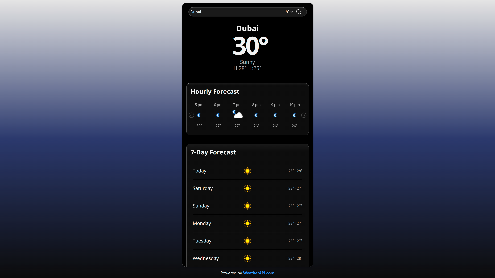
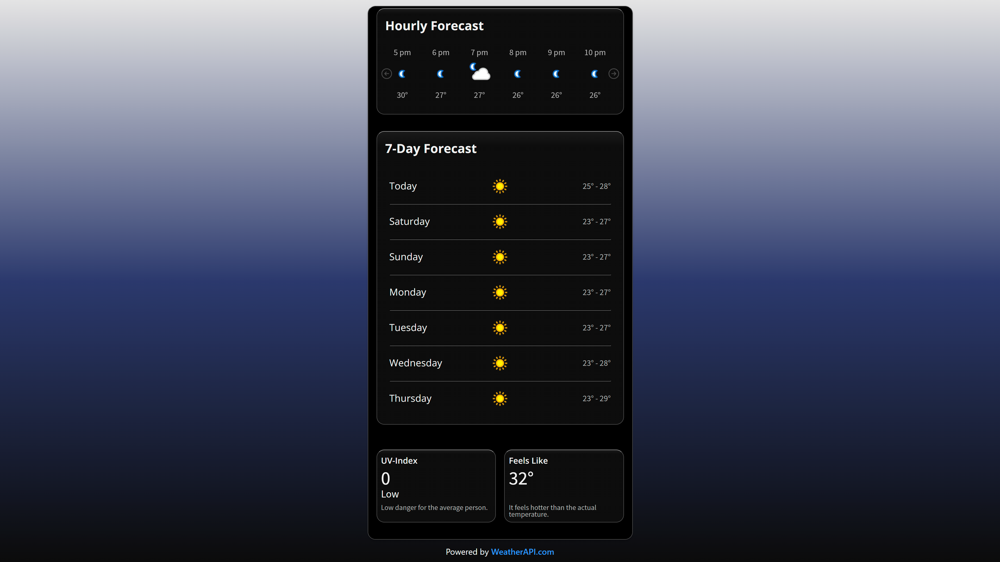

# Weather App

> A responsive weather application that provides real-time weather data and forecasts using WeatherAPI. Automatically detects the user's location (with given permission) and displays local weather data. Users can search for locations and toggle between different temperature units.

---

## 🚀 Live Demo

🔗 [View Live](https://weather-app-alpha-red-28.vercel.app/)

---

## ✨ Features

- Fetches real time weather data from WeatherAPI.
- Detects location via Geolocation API.
- Saves the last searched location or user's location in localStorage for faster reload.
- Displays current, hourly and 7 day forecasts.
- Temperature toggle between Celsius and Fahrenheit.

---

## 🧰 Tech Stack

- **Languages:** JavaScript / HTML
- **Styling:** CSS
- **Build Tool:** Vite
- **API / Data:** WeatherAPI

---

## 📸 Screenshots

---
